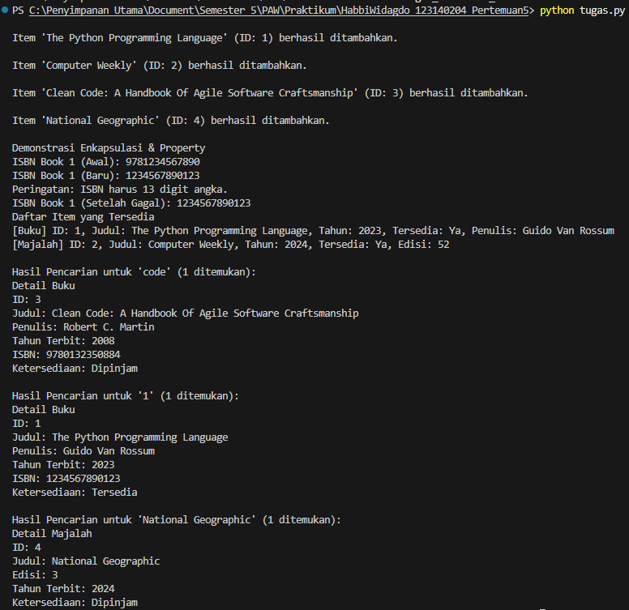

# Sistem Manajemen Perpustakaan (OOP Python)

Program ini merupakan implementasi konsep **Object-Oriented Programming (OOP)** dalam bahasa Python untuk mensimulasikan sistem manajemen perpustakaan sederhana. Program mendemonstrasikan penggunaan **abstract class**, **inheritance**, **polymorphism**, **encapsulation**, serta **property decorator**.

---

## Fungsi Program & Fitur-Fitur

### 1. **Manajemen Item Perpustakaan**
Program mampu mengelola dua jenis item:
- **Book**
- **Magazine**

Keduanya merupakan turunan dari abstract class `LibraryItem`.

### 2. **Penambahan Item**
Kelas `Library` menyediakan fungsi `add_item()` untuk menambahkan item ke dalam koleksi perpustakaan. ID item dibuat secara otomatis.

### 3. **Enkapsulasi & Property**
- ISBN pada kelas `Book` merupakan atribut **private** dan hanya bisa diakses melalui **getter/setter**.
- Setter ISBN memvalidasi bahwa ISBN harus 13 digit angka.

### 4. **Peminjaman & Pengembalian**
Setiap item dapat ditandai sebagai:
- **Dipinjam (`mark_as_borrowed`)**
- **Dikembalikan (`mark_as_returned`)**

### 5. **Polymorphism**
Method berikut diimplementasikan berbeda pada tiap subclass:
- `display_info()`
- `get_summary()`

Ketika program menampilkan daftar item atau hasil pencarian, method yang berjalan otomatis menyesuaikan tipe objek.

### 6. **Pencarian Item**
Fitur `search_item()` mendukung pencarian berdasarkan:
- **Judul** (case-insensitive, partial match)
- **ID** (pencarian unik)

---

## Screenshot Hasil Running Program

> **Catatan:** Ganti bagian berikut dengan screenshot milik Anda  
> (cukup tempelkan gambar dalam folder repo dan panggil seperti contoh)



---

## Diagram Class (Opsional – Nilai Tambah)

Berikut diagram class dalam bentuk UML sederhana:

## 🧩 1. Class: `LibraryItem` (Abstract)

| **Nama Class** | `LibraryItem` *(abstract)* |
|----------------|-----------------------------|

### Atribut
| Visibility | Atribut | Deskripsi |
|-----------|---------|------------|
| `-` | `_item_id` | ID unik item |
| `-` | `_title` | Judul item |
| `-` | `_year` | Tahun terbit |
| `-` | `_is_available` | Status ketersediaan item |

### Metode
| Visibility | Method | Deskripsi |
|-----------|--------|-----------|
| `+` | `display_info()` | Menampilkan informasi lengkap item |
| `+` | `get_summary()` | Mengembalikan ringkasan item |
| `+` | `mark_as_borrowed()` | Menandai item sebagai dipinjam |
| `+` | `mark_as_returned()` | Menandai item sebagai dikembalikan |
| `+` | `get_title()` | Mengambil judul item |
| `+` | `get_id()` | Mengambil ID item |
| `+` | `is_available()` | Mengecek apakah item tersedia |

---

## 📚 2. Class: `Book`

| **Nama Class** | `Book` *(extends LibraryItem)* |
|----------------|--------------------------------|

### Atribut
| Visibility | Atribut | Deskripsi |
|-----------|---------|------------|
| `-` | `_author` | Nama penulis |
| `-` | `__isbn` | Nomor ISBN (private) |

### Metode
| Visibility | Method | Deskripsi |
|-----------|--------|-----------|
| `+` | `display_info()` | Menampilkan info lengkap buku |
| `+` | `get_summary()` | Ringkasan informasi buku |
| `+` | `isbn` *(getter/setter)* | Akses dan ubah ISBN |

---

## 📰 3. Class: `Magazine`

| **Nama Class** | `Magazine` *(extends LibraryItem)* |
|----------------|------------------------------------|

### Atribut
| Visibility | Atribut | Deskripsi |
|-----------|---------|------------|
| `-` | `_issue_number` | Nomor edisi majalah |

### Metode
| Visibility | Method | Deskripsi |
|-----------|--------|-----------|
| `+` | `display_info()` | Menampilkan info lengkap majalah |
| `+` | `get_summary()` | Ringkasan informasi majalah |

---

## 🏛️ 4. Class: `Library`

| **Nama Class** | `Library` |
|----------------|-----------|

### Atribut
| Visibility | Atribut | Deskripsi |
|-----------|---------|------------|
| `-` | `__collection` | Daftar objek `LibraryItem` |

### Metode
| Visibility | Method | Deskripsi |
|-----------|--------|-----------|
| `+` | `add_item()` | Menambahkan item baru ke perpustakaan |
| `+` | `display_available_items()` | Menampilkan semua item yang tersedia |
| `+` | `search_item()` | Mencari item berdasarkan judul atau ID |

---

## Cara Menjalankan Program

1. Pastikan Python 3.x terinstal.
2. Simpan kode ke file bernama `library.py`.
3. Jalankan menggunakan:

```bash
python library.py